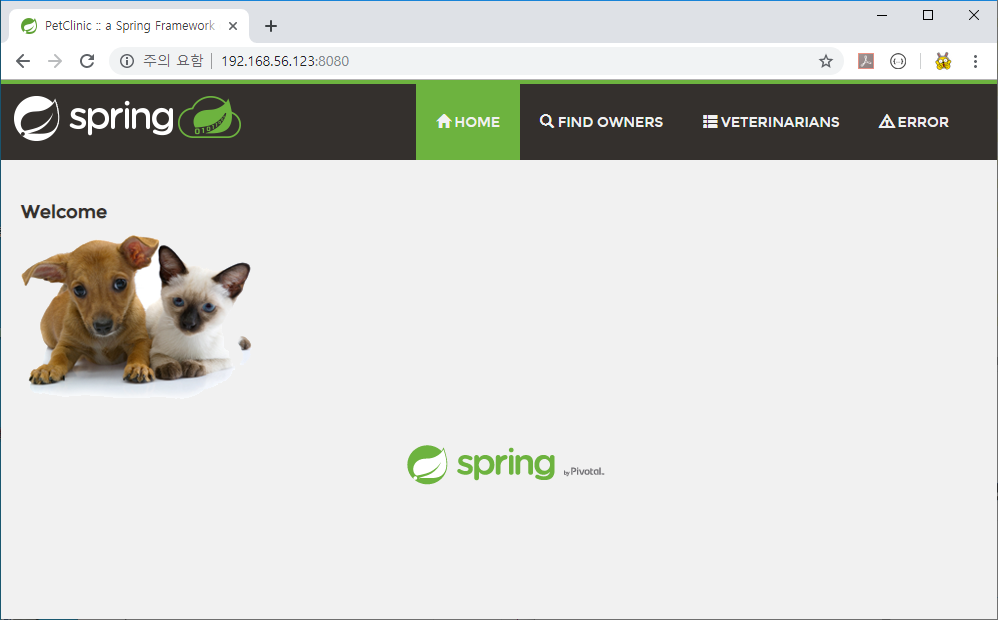
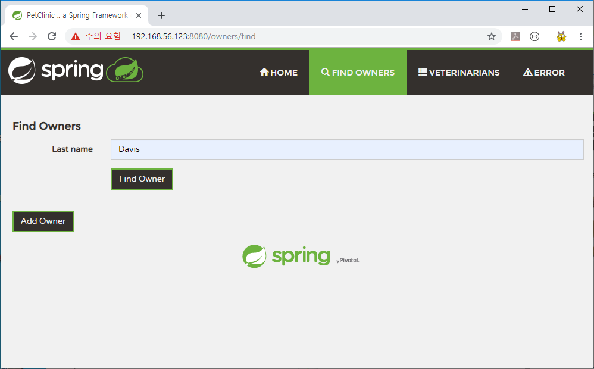
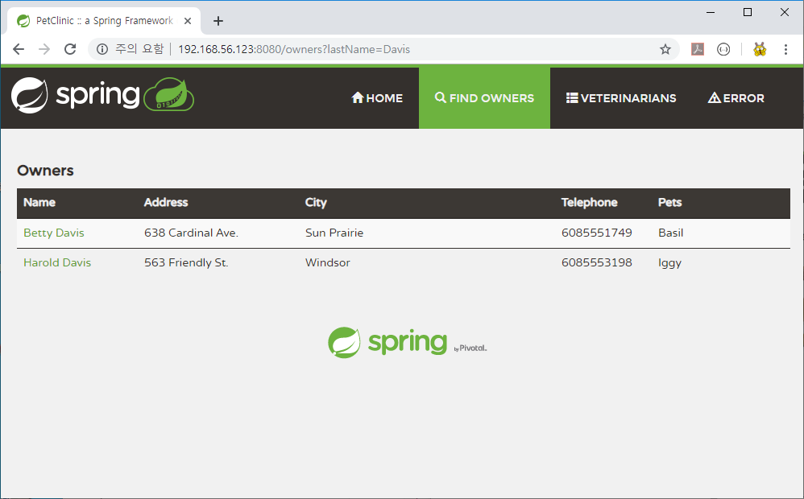

# 사전 준비 과정


### 1. Java 설치


#### Java 다운로드 및 설치

```sh
# mkdir /root/download
# cd /root/download
# curl -O -L https://cdn.azul.com/zulu/bin/zulu8.40.0.25-ca-jdk8.0.222-linux_x64.tar.gz
# tar xvfz zulu8.40.0.25-ca-jdk8.0.222-linux_x64.tar.gz
# mv zulu8.40.0.25-ca-jdk8.0.222-linux_x64 /usr/local/java
```


#### Java 환경변수 설정

/etc/profile 파일 편집

```sh
export JAVA_HOME=/usr/local/java
export PATH=$PATH:$JAVA_HOME/bin
```


#### Java 환경변수 로드

```sh
# source /etc/profile
```


#### Java 버전확인

```sh
# java -version
openjdk version "1.8.0_222"
OpenJDK Runtime Environment (Zulu 8.40.0.25-CA-linux64) (build 1.8.0_222-b10)
OpenJDK 64-Bit Server VM (Zulu 8.40.0.25-CA-linux64) (build 25.222-b10, mixed mode)
```


### 2. Maven 설치

#### Maven 다운로드 및 설치

```sh
# cd /root/download
# curl -O -L https://archive.apache.org/dist/maven/maven-3/3.3.9/binaries/apache-maven-3.3.9-bin.tar.gz
# tar xvfz apache-maven-3.3.9-bin.tar.gz
# mv apache-maven-3.3.9 /usr/local/maven
```


#### Maven 환경변수 설정

/etc/profile 파일 편집

```sh
export MAVEN_HOME=/usr/local/maven
export PATH=$PATH:$MAVEN_HOME/bin
```


#### Maven 환경변수 로드

```sh
# source /etc/profile
```


#### Maven 버전 확인

```sh
# mvn -version
Apache Maven 3.3.9 (bb52d8502b132ec0a5a3f4c09453c07478323dc5; 2015-11-11T01:41:47+09:00)
Maven home: /usr/local/maven
Java version: 1.8.0_222, vendor: Azul Systems, Inc.
Java home: /usr/local/java/jre
Default locale: ko_KR, platform encoding: UTF-8
OS name: "linux", version: "3.10.0-957.el7.x86_64", arch: "amd64", family: "unix"
```


### 3. Docker Community Edition 설치


#### 기존 Docker 삭제

```sh
# yum remove docker \
                  docker-client \
                  docker-client-latest \
                  docker-common \
                  docker-latest \
                  docker-latest-logrotate \
                  docker-logrotate \
                  docker-engine
```


#### Docker Community Edtion Repository 설정

```sh
# yum install -y yum-utils device-mapper-persistent-data lvm2
# yum-config-manager \
    --add-repo \
    https://download.docker.com/linux/centos/docker-ce.repo
```


#### Docker Community Edtion 설치

```sh
# yum install -y docker-ce docker-ce-cli containerd.io
```


#### SELINUX 업그레이드

SELINUX의 버전이 낮아서, Docker Community Edition이 정상적으로 설치가 안된 경우에만 진행함.

```sh
# yum -y install http://mirror.centos.org/centos/7/extras/x86_64/Packages/container-selinux-2.107-1.el7_6.noarch.rpm
```


#### Docker 서비스 실행

```sh
# systemctl start docker.service
```


#### Docker 버전 확인

```sh
# docker version
Client: Docker Engine - Community
 Version:           19.03.3
 API version:       1.40
 Go version:        go1.12.10
 Git commit:        a872fc2f86
 Built:             Tue Oct  8 00:58:10 2019
 OS/Arch:           linux/amd64
 Experimental:      false

Server: Docker Engine - Community
 Engine:
  Version:          19.03.3
  API version:      1.40 (minimum version 1.12)
  Go version:       go1.12.10
  Git commit:       a872fc2f86
  Built:            Tue Oct  8 00:56:46 2019
  OS/Arch:          linux/amd64
  Experimental:     false
 containerd:
  Version:          1.2.10
  GitCommit:        b34a5c8af56e510852c35414db4c1f4fa6172339
 runc:
  Version:          1.0.0-rc8+dev
  GitCommit:        3e425f80a8c931f88e6d94a8c831b9d5aa481657
 docker-init:
  Version:          0.18.0
  GitCommit:        fec3683
```


### 4. docker-compose 설치

#### docker-compose 파일 다운로드 및 설치

```sh
# curl -L https://github.com/docker/compose/releases/download/1.25.0-rc2/docker-compose-`uname -s`-`uname -m` -o /usr/local/bin/docker-compose
# chmod ugo+x /usr/local/bin/docker-compose
```


#### docker-compose 버전확인

```sh
# docker-compose -v
docker-compose version 1.25.0-rc2, build 661ac20e
```


### 5. 기존 이미지 삭제

본 과정은 필요시에 진행함.


#### 모든 컨테이너 중지

```sh
# docker stop $(docker ps -a -q)
```


#### 모든 컨테이너 삭제

```sh
# docker rm $(docker ps -a -q)
```


#### 모든 이미지 삭제

```sh
# docker rmi $(docker images -q)
```


# NGINX 

### NGINX 설정

#### NGINX 설정 디렉토리 생성

```sh
# mkdir /etc/nginx/conf.d/
```


#### /etc/nginx/conf.d/default.conf 파일 추가하여, NGINX Reverse Proxy를 설정함.

이 때 IP 주소(localhost)는 본인 환경에 맞게 올바르게 수정함.

80번 포트로 request 인입시에 8080 포트로 연결되는 구조.

```nginx
upstream app {
	server localhost:8080; 	# 도커 컨테이너 호스트의 IP 주소
}
 
server {
    listen       80;
 
    location / {
        proxy_pass http://app;
    }
}
```


# Petclinic 


### Petclinic 프로젝트 git clone

```sh
# mkdir -p /tmp/test/petclinic
# cd /tmp/test/petclinic
# git clone https://github.com/spring-projects/spring-petclinic.git
```


### Petclinic 프로젝트 수정 

##### /tmp/test/petclinic/spring-petclinic/src/main/resources/application-mysql.properties 파일 수정

이 때 IP 주소(localhost)는 본인 환경에 맞게 올바르게 수정함.

```ini
spring.datasource.username=petclinic
spring.datasource.password=petclinic
spring.datasource.url=jdbc:mysql://localhost/petclinic?characterEncoding=UTF-8&serverTimezone=UTC
```


##### /tmp/test/petclinic/spring-petclinic/src/main/resources/logback-spring.xml 파일 생성

로그는 /var/log/petclinic-web 에 기록되게끔 설정됨.

```xml
<?xml version="1.0" encoding="UTF-8"?>
<configuration>

    <!--
    <property name="LOG_DIR" value="${LOG_DIR:-./logs}" />
    <property name="LOG_FILENAME" value="${LOG_FILENAME:-petclinic}" />
    -->

    <property name="LOG_DIR" value="/var/log/petclinic-web" />
    <property name="LOG_FILENAME" value="petclinic" />

    <appender name="Console"
              class="ch.qos.logback.core.ConsoleAppender">
        <layout class="ch.qos.logback.classic.PatternLayout">
            <Pattern>
                %black(%d{ISO8601}) %highlight(%-5level) [%blue(%t)] %yellow(%C{1.}): %msg%n%throwable
            </Pattern>
        </layout>
    </appender>

    <appender name="RollingFile"
              class="ch.qos.logback.core.rolling.RollingFileAppender">
        <file>${LOG_DIR}/${LOG_FILENAME}.log</file>
        <encoder
            class="ch.qos.logback.classic.encoder.PatternLayoutEncoder">
            <Pattern>%d %p %C{1.} [%t] %m%n</Pattern>
        </encoder>

        <rollingPolicy
            class="ch.qos.logback.core.rolling.TimeBasedRollingPolicy">
            <!-- rollover daily and when the file reaches 10 MegaBytes -->
            <fileNamePattern>${LOG_DIR}/archived/${LOG_FILENAME}-%d{yyyy-MM-dd}.%i.log
            </fileNamePattern>
            <timeBasedFileNamingAndTriggeringPolicy
                class="ch.qos.logback.core.rolling.SizeAndTimeBasedFNATP">
                <maxFileSize>10MB</maxFileSize>
            </timeBasedFileNamingAndTriggeringPolicy>
        </rollingPolicy>
    </appender>

    <!-- LOG everything at INFO level -->
    <root level="info">
        <appender-ref ref="RollingFile" />
        <appender-ref ref="Console" />
    </root>

    <!-- LOG "com.baeldung*" at TRACE level -->
    <logger name="org.springframework.samples.petclinic" level="trace" additivity="false">
        <appender-ref ref="RollingFile" />
        <appender-ref ref="Console" />
    </logger>

</configuration>
```


### Petclinic 프로젝트 빌드

#### 빌드

빌드 과정은 와이파이 환경인 경우, 약 20분 ~ 30분 정도 소요됨.

```sh
# cd /tmp/test/petclinic/spring-petclinic
# mvn clean package -Dmaven.test.skip=true
```


#### 빌드 결과 확인

```sh
# ls -al /tmp/test/petclinic/spring-petclinic/target
합계 46872
drwxr-xr-x. 7 root root      209 10월 23 13:09 .
drwxr-xr-x. 8 root root      233 10월 23 13:09 ..
drwxr-xr-x. 2 root root       37 10월 23 13:09 .wro4j
drwxr-xr-x. 8 root root      222 10월 23 13:09 classes
drwxr-xr-x. 3 root root       25 10월 23 13:09 generated-sources
drwxr-xr-x. 2 root root       28 10월 23 13:09 maven-archiver
drwxr-xr-x. 3 root root       35 10월 23 13:09 maven-status
-rw-r--r--. 1 root root 47613236 10월 23 13:09 spring-petclinic-2.2.0.BUILD-SNAPSHOT.jar
-rw-r--r--. 1 root root   380900 10월 23 13:09 spring-petclinic-2.2.0.BUILD-SNAPSHOT.jar.original
```


#### 빌드 결과물 복사

```sh
# cp /tmp/test/petclinic/spring-petclinic/target/spring-petclinic-2.2.0.BUILD-SNAPSHOT.jar /tmp/test/petclinic/
```


# docker compose


본 스탭의 진행 과정은 `/tmp/test` 디렉토리에서 진행되고 있음을 가정합니다.


### docker-compose 빌드 스크립트 작성

#### /tmp/test/docker-compose.yml 파일 생성

```yaml
version: '2'

services:
  nginx:
    image: nginx:latest
    hostname: nginx
    container_name: nginx
    volumes:
      - /etc/nginx/conf.d:/etc/nginx/conf.d
    ports:
      - "80:80"
      
  mysql:
    image: mysql:5.7
    hostname: mysql
    container_name: mysql
    volumes:
      - /var/lib/mysql:/var/lib/mysql
    ports:
      - "3306:3306"
    environment:
      - MYSQL_ROOT_PASSWORD=1111
      
  
  petclinic-web:
    build: 
      context: /tmp/test/petclinic
      dockerfile: /tmp/test/petclinic/Dockerfile
    image: petclinic-web  
    hostname: petclinic-web
    container_name: petclinic-web
    volumes:
      - /var/log/petclinic-web:/var/log/petclinic-web
    ports:
      - "8080:8080"
    environment:
      - LOG_DIR=/var/log/petclinic-web
      - LOG_FILENAME=petclinic
    depends_on:
      - nginx
      - mysql      
```


#### /tmp/test/petclinic/Dockerfile 파일 생성

```dockerfile
FROM openjdk:8-jdk-alpine
VOLUME /tmp
ADD spring-petclinic-2.2.0.BUILD-SNAPSHOT.jar spring-petclinic-2.2.0.BUILD-SNAPSHOT.jar
ENTRYPOINT ["java","-Dspring.profiles.active=mysql","-Djava.security.egd=file:/dev/./urandom","-jar","/spring-petclinic-2.2.0.BUILD-SNAPSHOT.jar"]
```


### docker-compose up 

docker-compose 안에 명세된 이미지를 모두 pull 받고, 컨테이너까지 실행함.

```sh
# docker-compose -f /tmp/test/docker-compose.yml up -d
```


### docker-compose ps

```sh
# docker-compose -f /tmp/test/docker-compose.yml ps
    Name                   Command               State                 Ports
------------------------------------------------------------------------------------------
mysql           docker-entrypoint.sh mysqld      Up      0.0.0.0:3306->3306/tcp, 33060/tcp
nginx           nginx -g daemon off;             Up      0.0.0.0:80->80/tcp
petclinic-web   java -Dspring.profiles.act ...   Up      0.0.0.0:8080->8080/tcp
```


### petclinic mysql 설정

#### petclinic mysql 콘솔 접속

```sh
# docker exec -i -t mysql mysql -u root -p
Enter password:
Welcome to the MySQL monitor.  Commands end with ; or \g.
Your MySQL connection id is 14
Server version: 5.7.28 MySQL Community Server (GPL)

Copyright (c) 2000, 2019, Oracle and/or its affiliates. All rights reserved.

Oracle is a registered trademark of Oracle Corporation and/or its
affiliates. Other names may be trademarks of their respective
owners.

Type 'help;' or '\h' for help. Type '\c' to clear the current input statement.

mysql> #### 이곳에 SQL 쿼리를 복붙함. ####
```


#### petclinic 사용자 추가 쿼리 실행

```sh
CREATE USER 'petclinic'@'%' IDENTIFIED BY 'petclinic';
GRANT ALL PRIVILEGES ON *.* TO petclinic@'%' IDENTIFIED BY 'petclinic';
```


#### schema.sql 파일 import 쿼리 실행

```sql
CREATE DATABASE IF NOT EXISTS petclinic;

ALTER DATABASE petclinic
  DEFAULT CHARACTER SET utf8
  DEFAULT COLLATE utf8_general_ci;

GRANT ALL PRIVILEGES ON petclinic.* TO petclinic@localhost IDENTIFIED BY 'petclinic';

USE petclinic;

CREATE TABLE IF NOT EXISTS vets (
  id INT(4) UNSIGNED NOT NULL AUTO_INCREMENT PRIMARY KEY,
  first_name VARCHAR(30),
  last_name VARCHAR(30),
  INDEX(last_name)
) engine=InnoDB;

CREATE TABLE IF NOT EXISTS specialties (
  id INT(4) UNSIGNED NOT NULL AUTO_INCREMENT PRIMARY KEY,
  name VARCHAR(80),
  INDEX(name)
) engine=InnoDB;

CREATE TABLE IF NOT EXISTS vet_specialties (
  vet_id INT(4) UNSIGNED NOT NULL,
  specialty_id INT(4) UNSIGNED NOT NULL,
  FOREIGN KEY (vet_id) REFERENCES vets(id),
  FOREIGN KEY (specialty_id) REFERENCES specialties(id),
  UNIQUE (vet_id,specialty_id)
) engine=InnoDB;

CREATE TABLE IF NOT EXISTS types (
  id INT(4) UNSIGNED NOT NULL AUTO_INCREMENT PRIMARY KEY,
  name VARCHAR(80),
  INDEX(name)
) engine=InnoDB;

CREATE TABLE IF NOT EXISTS owners (
  id INT(4) UNSIGNED NOT NULL AUTO_INCREMENT PRIMARY KEY,
  first_name VARCHAR(30),
  last_name VARCHAR(30),
  address VARCHAR(255),
  city VARCHAR(80),
  telephone VARCHAR(20),
  INDEX(last_name)
) engine=InnoDB;

CREATE TABLE IF NOT EXISTS pets (
  id INT(4) UNSIGNED NOT NULL AUTO_INCREMENT PRIMARY KEY,
  name VARCHAR(30),
  birth_date DATE,
  type_id INT(4) UNSIGNED NOT NULL,
  owner_id INT(4) UNSIGNED NOT NULL,
  INDEX(name),
  FOREIGN KEY (owner_id) REFERENCES owners(id),
  FOREIGN KEY (type_id) REFERENCES types(id)
) engine=InnoDB;

CREATE TABLE IF NOT EXISTS visits (
  id INT(4) UNSIGNED NOT NULL AUTO_INCREMENT PRIMARY KEY,
  pet_id INT(4) UNSIGNED NOT NULL,
  visit_date DATE,
  description VARCHAR(255),
  FOREIGN KEY (pet_id) REFERENCES pets(id)
) engine=InnoDB;

```


#### data.sql 파일 import 쿼리 실행

```sql
INSERT IGNORE INTO vets VALUES (1, 'James', 'Carter');
INSERT IGNORE INTO vets VALUES (2, 'Helen', 'Leary');
INSERT IGNORE INTO vets VALUES (3, 'Linda', 'Douglas');
INSERT IGNORE INTO vets VALUES (4, 'Rafael', 'Ortega');
INSERT IGNORE INTO vets VALUES (5, 'Henry', 'Stevens');
INSERT IGNORE INTO vets VALUES (6, 'Sharon', 'Jenkins');

INSERT IGNORE INTO specialties VALUES (1, 'radiology');
INSERT IGNORE INTO specialties VALUES (2, 'surgery');
INSERT IGNORE INTO specialties VALUES (3, 'dentistry');

INSERT IGNORE INTO vet_specialties VALUES (2, 1);
INSERT IGNORE INTO vet_specialties VALUES (3, 2);
INSERT IGNORE INTO vet_specialties VALUES (3, 3);
INSERT IGNORE INTO vet_specialties VALUES (4, 2);
INSERT IGNORE INTO vet_specialties VALUES (5, 1);

INSERT IGNORE INTO types VALUES (1, 'cat');
INSERT IGNORE INTO types VALUES (2, 'dog');
INSERT IGNORE INTO types VALUES (3, 'lizard');
INSERT IGNORE INTO types VALUES (4, 'snake');
INSERT IGNORE INTO types VALUES (5, 'bird');
INSERT IGNORE INTO types VALUES (6, 'hamster');

INSERT IGNORE INTO owners VALUES (1, 'George', 'Franklin', '110 W. Liberty St.', 'Madison', '6085551023');
INSERT IGNORE INTO owners VALUES (2, 'Betty', 'Davis', '638 Cardinal Ave.', 'Sun Prairie', '6085551749');
INSERT IGNORE INTO owners VALUES (3, 'Eduardo', 'Rodriquez', '2693 Commerce St.', 'McFarland', '6085558763');
INSERT IGNORE INTO owners VALUES (4, 'Harold', 'Davis', '563 Friendly St.', 'Windsor', '6085553198');
INSERT IGNORE INTO owners VALUES (5, 'Peter', 'McTavish', '2387 S. Fair Way', 'Madison', '6085552765');
INSERT IGNORE INTO owners VALUES (6, 'Jean', 'Coleman', '105 N. Lake St.', 'Monona', '6085552654');
INSERT IGNORE INTO owners VALUES (7, 'Jeff', 'Black', '1450 Oak Blvd.', 'Monona', '6085555387');
INSERT IGNORE INTO owners VALUES (8, 'Maria', 'Escobito', '345 Maple St.', 'Madison', '6085557683');
INSERT IGNORE INTO owners VALUES (9, 'David', 'Schroeder', '2749 Blackhawk Trail', 'Madison', '6085559435');
INSERT IGNORE INTO owners VALUES (10, 'Carlos', 'Estaban', '2335 Independence La.', 'Waunakee', '6085555487');

INSERT IGNORE INTO pets VALUES (1, 'Leo', '2000-09-07', 1, 1);
INSERT IGNORE INTO pets VALUES (2, 'Basil', '2002-08-06', 6, 2);
INSERT IGNORE INTO pets VALUES (3, 'Rosy', '2001-04-17', 2, 3);
INSERT IGNORE INTO pets VALUES (4, 'Jewel', '2000-03-07', 2, 3);
INSERT IGNORE INTO pets VALUES (5, 'Iggy', '2000-11-30', 3, 4);
INSERT IGNORE INTO pets VALUES (6, 'George', '2000-01-20', 4, 5);
INSERT IGNORE INTO pets VALUES (7, 'Samantha', '1995-09-04', 1, 6);
INSERT IGNORE INTO pets VALUES (8, 'Max', '1995-09-04', 1, 6);
INSERT IGNORE INTO pets VALUES (9, 'Lucky', '1999-08-06', 5, 7);
INSERT IGNORE INTO pets VALUES (10, 'Mulligan', '1997-02-24', 2, 8);
INSERT IGNORE INTO pets VALUES (11, 'Freddy', '2000-03-09', 5, 9);
INSERT IGNORE INTO pets VALUES (12, 'Lucky', '2000-06-24', 2, 10);
INSERT IGNORE INTO pets VALUES (13, 'Sly', '2002-06-08', 1, 10);

INSERT IGNORE INTO visits VALUES (1, 7, '2010-03-04', 'rabies shot');
INSERT IGNORE INTO visits VALUES (2, 8, '2011-03-04', 'rabies shot');
INSERT IGNORE INTO visits VALUES (3, 8, '2009-06-04', 'neutered');
INSERT IGNORE INTO visits VALUES (4, 7, '2008-09-04', 'spayed');

```


# Petclinic 웹사이트 경험


### 웹사이트 접속

IP 주소(localhost)는 본인 환경에 맞게 수정함.

```
http://localhost:8080/
```




### Petclinic 주인 검색

```
http://localhost:8080/owners/find
```




### Petclinic 주인검색 결과

